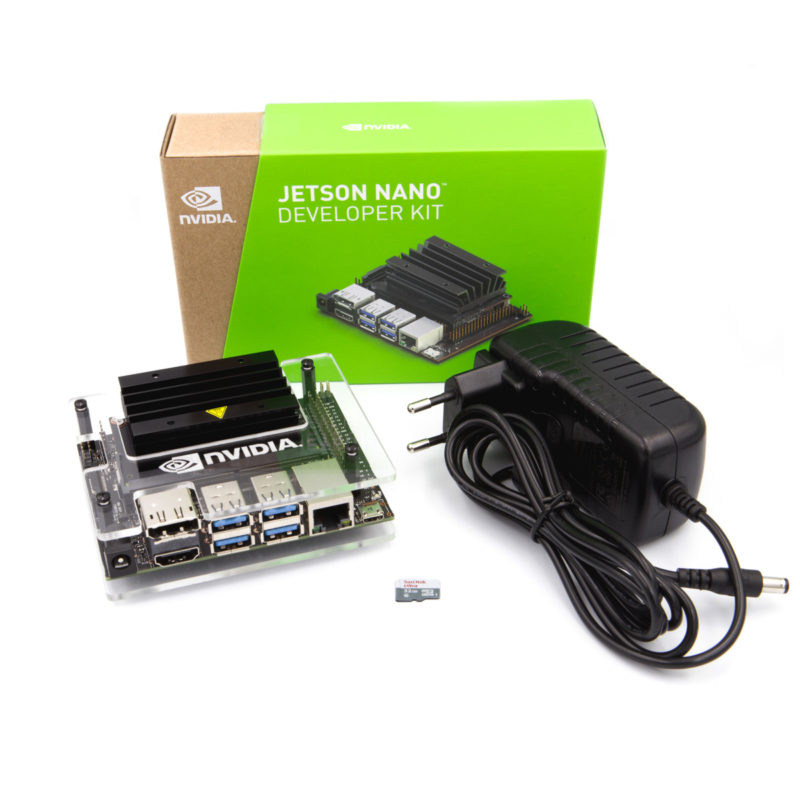

# Senior Project Presentation

This is the documentation for my ASD senior project. I worked on a prototype that would detect and classify traffic signs, and would detect speeding with the vehicle diagnostics system (OBD-II).

## Parts Used

## The Nvidia Jetson Nano

The Nvidia Jetson Nano is the board I decided to use for my senior project. It has a much more powerful GPU than the Raspberry Pi, and therefore works well in GPU-intensive applications, such as machine learning. The Nvidia Jetson Nano isn't a technically a single board computer, as it has two components: the carrier board and the compute/system on a chip (SoC) module. It does share the same 40 pin GPIO layout as the Raspberry Pi, but the current output is lower, and Hardware Pulse Width Modulation (PWM) is disabled by default. A networking card is needed to wireless connectivity and Bluetooth. It can run off of USB power, but it will only draw up to 2 Amps through USB. The SoC module itself requires 2 Amps to run without throttling performance, so ideally the board needs about 3 Amps, as the carrier board requires additional power. The Jetson Nano can run Nvidia's JetPack software, which is based on Ubuntu 18.04. The Jetson Nano Developer Kit boots from a MicroSD, similar to a Raspberry Pi and other single board computers. 

## Physical Assembly

## OS Installation

## My Object Detection Model

## Object Detection Model Training

## Classification Model (Attempt)

## OCR Investigations

## Setting up Tesseract on the Jetson Nano

## Developing a Power Supply for a Vehicle

## Enabling PWM on the Jetson Nano

## OBD-II: Preparation

## OBD-II: Connection

## Setting up a cronjob
