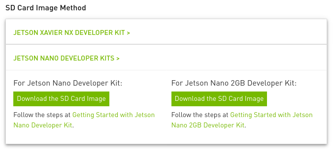

# Senior Project Presentation

This is the documentation for my ASD senior project. I worked on a prototype that would detect and classify traffic signs, and would detect speeding with the vehicle diagnostics system (OBD-II).

## Parts Used

## The Nvidia Jetson Nano

The Nvidia Jetson Nano is the board I decided to use for my senior project. It has a much more powerful GPU than the Raspberry Pi, and therefore works well in GPU-intensive applications, such as machine learning. The Nvidia Jetson Nano isn't a technically a single board computer, as it has two components: the carrier board and the compute/system on a chip (SoC) module. It does share the same 40 pin GPIO layout as the Raspberry Pi, but the current output is lower, and Hardware Pulse Width Modulation (PWM) is disabled by default. A networking card is needed to wireless connectivity and Bluetooth. It can run off of USB power, but it will only draw up to 2 Amps through USB. The SoC module itself requires 2 Amps to run without throttling performance, so ideally the board needs about 3 Amps, as the carrier board requires additional power. The Jetson Nano can run Nvidia's JetPack software, which is based on Ubuntu 18.04. The Jetson Nano Developer Kit boots from a MicroSD, similar to a Raspberry Pi and other single board computers. 


## Physical Assembly

## OS Installation

You can get the image needed from [here](https://developer.nvidia.com/embedded/jetpack#install). Go to the SD Card Image Method subsection, and select the Jetson Nano. It should look like this:



As you can see, the images are different depending on the RAM. I did this project with the Jetson Nano 4GB, since that was the only model that existed when I started the project. It theoretically is possible to do this project with the Jetson Nano 2GB, but it will have to swap more aggressively, especially if you do the object detection training on the board. Anyways, just get the image you need, as getting the wrong image will likely render the board unbootable.

[Nvidia has a good guide on flashing the image with to the SD with Etcher.](https://developer.nvidia.com/embedded/learn/get-started-jetson-nano-devkit#write) I didn't use Etcher and used dd instead. dd comes with MacOS and most Linux distributions. Using dd doesn't require a GUI, but be careful if you do this approach! Etcher has protections set in place to avoid overwriting your main drive, while dd does not. If you're doing the dd approach, you can find the drive with fdisk:

```
$ sudo fdisk -l
Disk /dev/nvme1n1: 238.47 GiB, 256060514304 bytes, 500118192 sectors
Disk model: SKHynix_HFS256GD9TNI-L2B0B              
Units: sectors of 1 * 512 = 512 bytes
Sector size (logical/physical): 512 bytes / 512 bytes
I/O size (minimum/optimal): 512 bytes / 512 bytes
Disklabel type: gpt
Disk identifier: 82FD43FC-4343-417E-A104-CC28E18B9347

Device             Start       End   Sectors   Size Type
/dev/nvme1n1p1      2048    534527    532480   260M EFI System
/dev/nvme1n1p2    534528    567295     32768    16M Microsoft reserved
/dev/nvme1n1p3    567296 498069503 497502208 237.2G Microsoft basic data
/dev/nvme1n1p4 498069504 500117503   2048000  1000M Windows recovery environment


Disk /dev/nvme0n1: 465.76 GiB, 500107862016 bytes, 976773168 sectors
Disk model: CT500P2SSD8                             
Units: sectors of 1 * 512 = 512 bytes
Sector size (logical/physical): 512 bytes / 512 bytes
I/O size (minimum/optimal): 512 bytes / 512 bytes
Disklabel type: gpt
Disk identifier: 00B5F5A9-82C7-434B-846B-0BD2243F1137

Device             Start       End   Sectors   Size Type
/dev/nvme0n1p1      4096   1023998   1019903   498M EFI System
/dev/nvme0n1p2   1024000   9412606   8388607     4G Microsoft basic data
/dev/nvme0n1p3   9412608 968380462 958967855 457.3G Linux filesystem
/dev/nvme0n1p4 968380464 976769070   8388607     4G Linux swap


Disk /dev/mapper/cryptswap: 4 GiB, 4294442496 bytes, 8387583 sectors
Units: sectors of 1 * 512 = 512 bytes
Sector size (logical/physical): 512 bytes / 512 bytes
I/O size (minimum/optimal): 512 bytes / 512 bytes
```

In this case, the SD card is recognized as `/dev/sda`. Make absolutely sure you're accessing the right device! Now you can unzip and flash:

```
$ unzip <compressed_image>.zip
$ sudo umount <device_location>
$ sudo dd bs=4M if=<raw_image>.img of=<device_location>
```

Once flashed, you can take the SD card out and put in into the Jetson Nano. I did the intial setup with a keyboard, mouse and monitor hooked up to the board. I called my user account tbilik, so that's the user account listed in the documentation. I did most development in headless mode. You can do this by connecting the micro USB on the Jetson to your computer, and establishing an SSH connection:

```
ssh tbilik@192.168.55.1
```

TRAMP mode in GNU/Emacs also works great! I did most coding and file management with GNU/Emacs for my project. (Here's a guide for setting up TRAMP mode.)[https://www.emacswiki.org/emacs/TrampMode]

## My Object Detection Model

## Object Detection Model Training

## Classification Model (Attempt)

## OCR Investigations

## Setting up Tesseract on the Jetson Nano

## Developing a Power Supply for a Vehicle

## Enabling PWM on the Jetson Nano

## OBD-II: Preparation

## OBD-II: Connection

## Setting up a cronjob
