# Senior Project Documentation

This is the documentation for my ASD senior project. I worked on a prototype that would detect and classify traffic signs, and would detect speeding with the vehicle diagnostics system (OBD-II).


## Parts Used

- Nvidia Jetson Nano
- Adafruit 7-segment display
- Passive buzzer
- Black acryllic case
- Intel 9260 wireless card
- 5V 3A buck converter
- 32 GB SD card (I would recommend 64 GB though)
- 160 degree angle range CSI camera
- ELM327 Adapter

## The Nvidia Jetson Nano

The Nvidia Jetson Nano is the board I decided to use for my senior project. It has a much more powerful GPU than the Raspberry Pi, and therefore works well in GPU-intensive applications, such as machine learning. The Nvidia Jetson Nano isn't a technically a single board computer, as it has two components: the carrier board and the compute/system on a chip (SoC) module. It does share the same 40 pin GPIO layout as the Raspberry Pi, but the current output is lower, and Hardware Pulse Width Modulation (PWM) is disabled by default. A networking card is needed to wireless connectivity and Bluetooth. It can run off of USB power, but it will only draw up to 2 Amps through USB. The SoC module itself requires 2 Amps to run without throttling performance, so ideally the board needs about 3 Amps, as the carrier board requires additional power. The Jetson Nano can run Nvidia's JetPack software, which is based on Ubuntu 18.04. The Jetson Nano Developer Kit boots from a MicroSD, similar to a Raspberry Pi and other single board computers. 


## Physical Assembly and Design of my Prototype

Front of the prototype contains the 7-segment display.

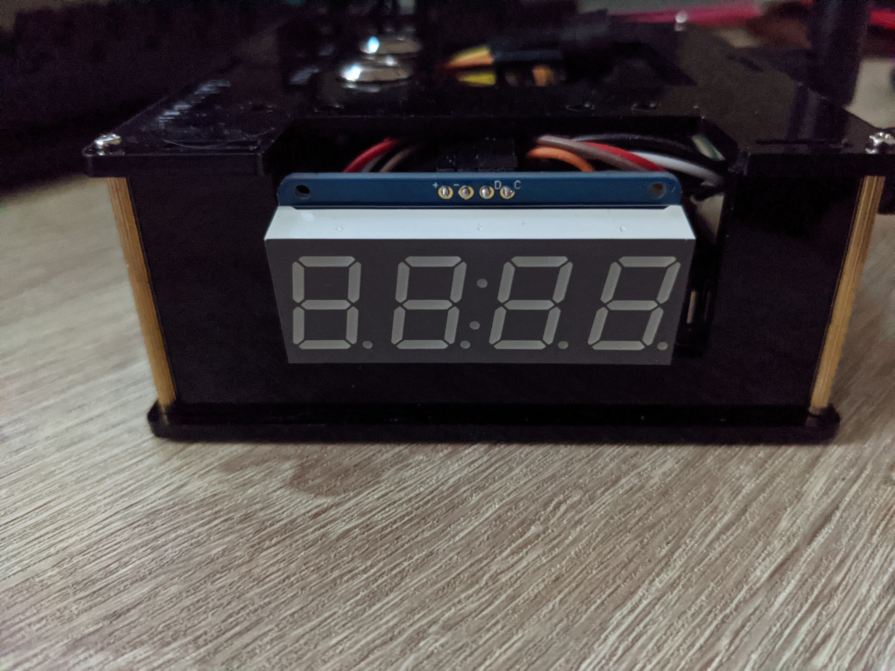

The left side of the prototype has the ports and barrel jack power, and the right side of the prototype has antennas for the networking card. The networking card is only needed for the ELM327 OBD-II adapter.

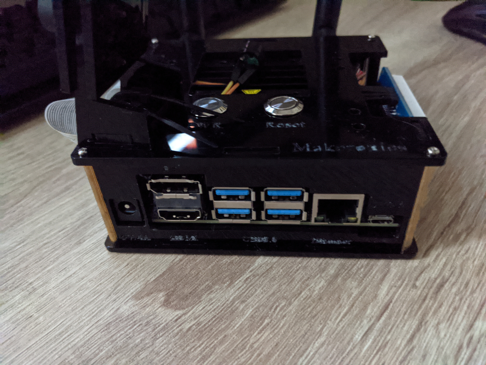
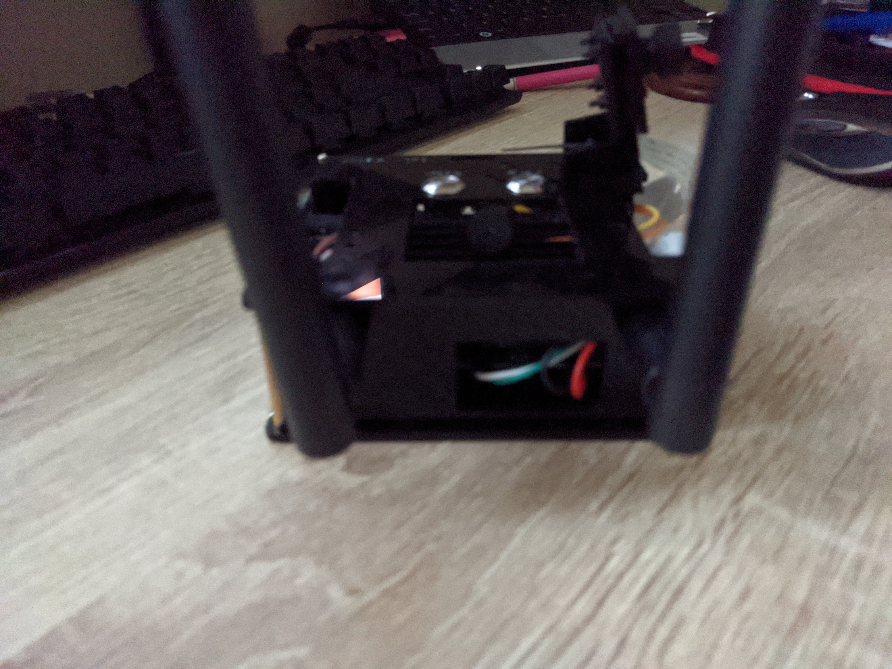

The back of the prototype contains the camera module.

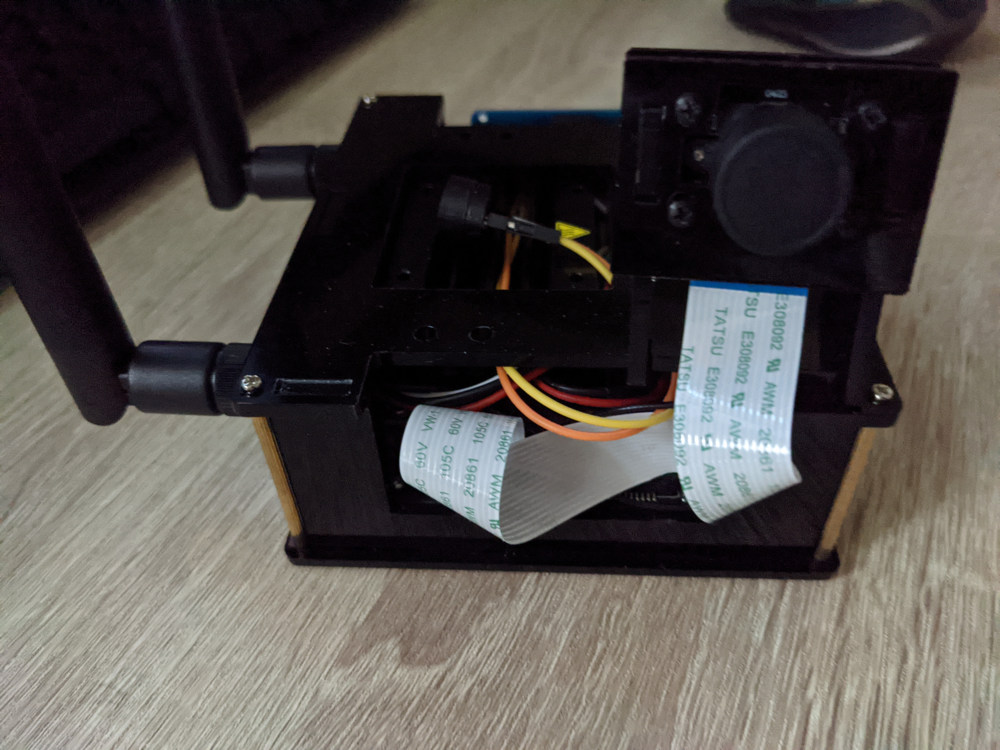

The top of the prototype has the heat sink, power button, reset button (which is actually hooked up to the GPIO pins to act as a regular button), and a passive buzzer.

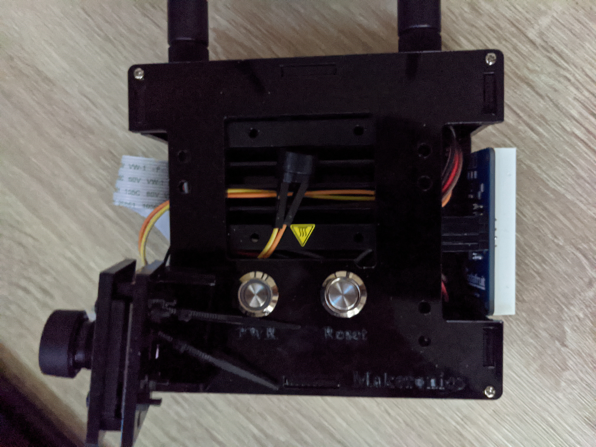

Here is all of the wiring. The display is hooked up to pins 3 and 5, the buzzer is connected to pin 32, and the reset button is hooked up to pin 19. Even though pin 19 has an interal pull-down resistor, it still seemed to be floating, so I put a 330 ohm resistor from pin 19 to ground.

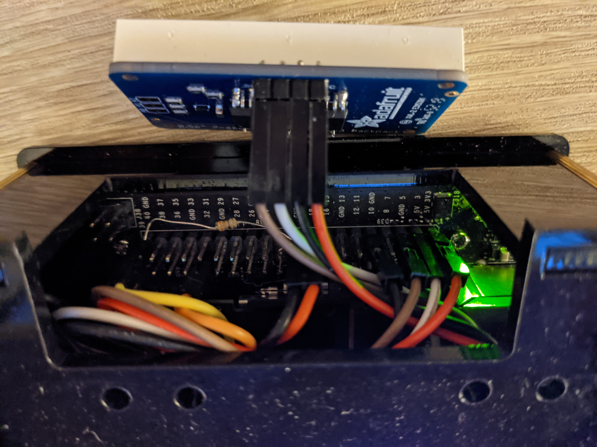

Some photos of the prototype operating in my car.

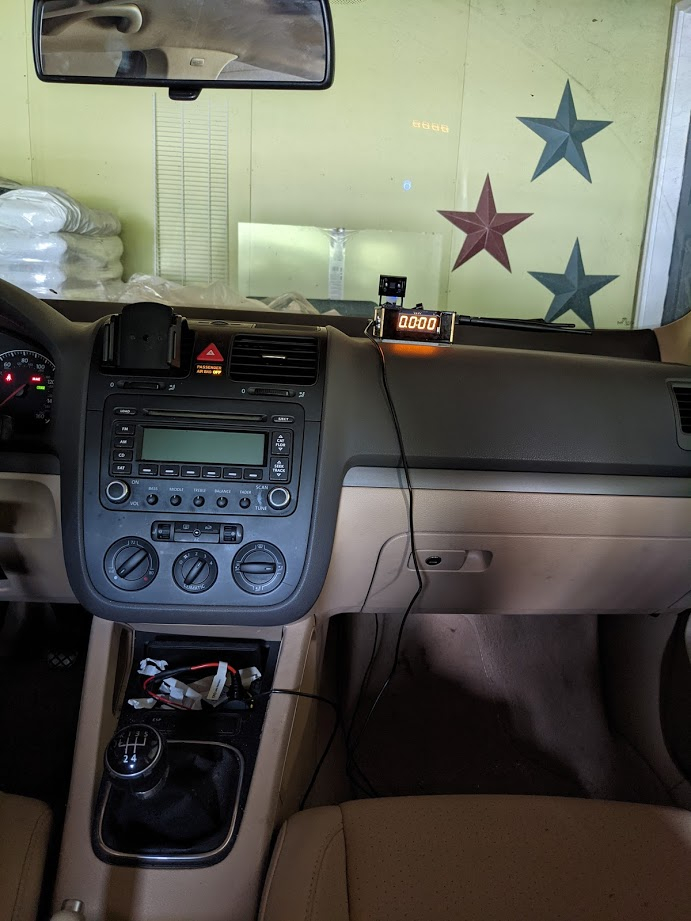
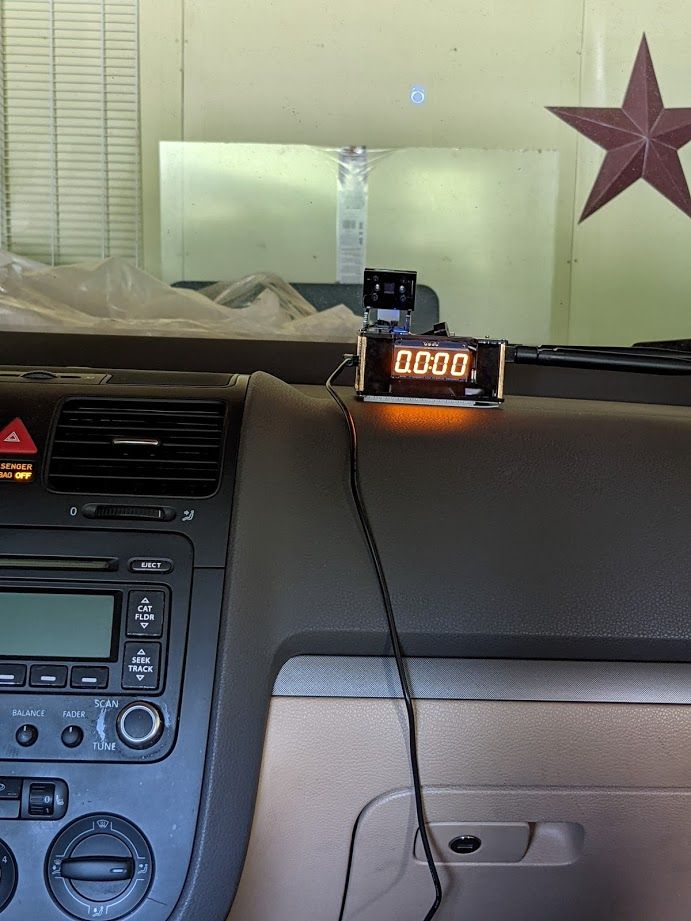

## OS Installation

You can get the image needed from [here](https://developer.nvidia.com/embedded/jetpack#install). Go to the SD Card Image Method subsection, and select the Jetson Nano. It should look like this:


As you can see, the images are different depending on the RAM. I did this project with the Jetson Nano 4GB, since that was the only model that existed when I started the project. It theoretically is possible to do this project with the Jetson Nano 2GB, but it will have to swap more aggressively, especially if you do the object detection training on the board. Anyways, just get the image you need, as getting the wrong image will likely render the board unbootable.

[Nvidia has a good guide on flashing the image with to the SD with Etcher.](https://developer.nvidia.com/embedded/learn/get-started-jetson-nano-devkit#write) I didn't use Etcher and used dd instead. dd comes with MacOS and most Linux distributions. Using dd doesn't require a GUI, but be careful if you do this approach! Etcher has protections set in place to avoid overwriting your main drive, while dd does not. If you're doing the dd approach, you can find the drive with fdisk:

```
$ sudo fdisk -l
Disk /dev/nvme1n1: 238.47 GiB, 256060514304 bytes, 500118192 sectors
Disk model: SKHynix_HFS256GD9TNI-L2B0B              
Units: sectors of 1 * 512 = 512 bytes
Sector size (logical/physical): 512 bytes / 512 bytes
I/O size (minimum/optimal): 512 bytes / 512 bytes
Disklabel type: gpt
Disk identifier: 82FD43FC-4343-417E-A104-CC28E18B9347

Device             Start       End   Sectors   Size Type
/dev/nvme1n1p1      2048    534527    532480   260M EFI System
/dev/nvme1n1p2    534528    567295     32768    16M Microsoft reserved
/dev/nvme1n1p3    567296 498069503 497502208 237.2G Microsoft basic data
/dev/nvme1n1p4 498069504 500117503   2048000  1000M Windows recovery environment


Disk /dev/nvme0n1: 465.76 GiB, 500107862016 bytes, 976773168 sectors
Disk model: CT500P2SSD8                             
Units: sectors of 1 * 512 = 512 bytes
Sector size (logical/physical): 512 bytes / 512 bytes
I/O size (minimum/optimal): 512 bytes / 512 bytes
Disklabel type: gpt
Disk identifier: 00B5F5A9-82C7-434B-846B-0BD2243F1137

Device             Start       End   Sectors   Size Type
/dev/nvme0n1p1      4096   1023998   1019903   498M EFI System
/dev/nvme0n1p2   1024000   9412606   8388607     4G Microsoft basic data
/dev/nvme0n1p3   9412608 968380462 958967855 457.3G Linux filesystem
/dev/nvme0n1p4 968380464 976769070   8388607     4G Linux swap


Disk /dev/mapper/cryptswap: 4 GiB, 4294442496 bytes, 8387583 sectors
Units: sectors of 1 * 512 = 512 bytes
Sector size (logical/physical): 512 bytes / 512 bytes
I/O size (minimum/optimal): 512 bytes / 512 bytes


Disk /dev/sda: 29.72 GiB, 31914983424 bytes, 62333952 sectors
Disk model: SD  Transcend   
Units: sectors of 1 * 512 = 512 bytes
Sector size (logical/physical): 512 bytes / 512 bytes
I/O size (minimum/optimal): 512 bytes / 512 bytes
Disklabel type: gpt
Disk identifier: 4E39CA32-5E71-B640-93C7-8F1F7505F649

Device     Start      End  Sectors  Size Type
/dev/sda1   2048 62333918 62331871 29.7G Linux filesystem
```

In this case, the SD card is recognized as `/dev/sda`. Make absolutely sure you're accessing the right device! Now you can unzip and flash:

```
$ unzip <compressed_image>.zip
$ sudo umount <device_location>
$ sudo dd bs=4M if=<raw_image>.img of=<device_location>
```

Once flashed, you can take the SD card out and put in into the Jetson Nano. I did the intial setup with a keyboard, mouse and monitor hooked up to the board. I called my user account tbilik, so that's the user account listed in the documentation. I did most development in headless mode. You can do this by connecting the micro USB on the Jetson to your computer, and establishing an SSH connection:

```
ssh tbilik@192.168.55.1
```

TRAMP mode in GNU/Emacs also works great! I did most coding and file management with GNU/Emacs for my project. [Here's a guide for setting up TRAMP mode.](https://www.emacswiki.org/emacs/TrampMode)

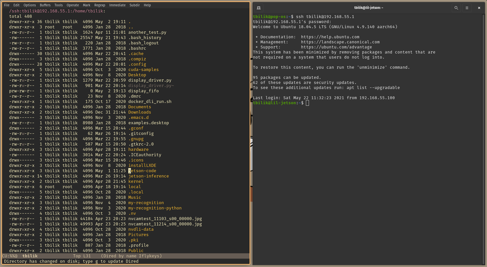

## My Object Detection Model

There are several frameworks for machine learning object detection algorithms. Region proposal based frameworks and regression/classification based frameworks are the two main categories of frameworks. Region proposal based frameworks have a more general pipeline in the beginning of the section: the framework generates various image windows to test, and then it classifies the image windows. The most popular framework in the category is the R-CNN framework. Given an image, the R-CNN generates approximately 2,000 image windows to test using a selective search algorithm. It warps and re-scales the image windows with objects detected to fit in a 227 by 227 image. The re-scaling is a requirement for the neural network that classifies the windows. The selective search algorithm can produce redundant windows (two windows that contain the same object), and the rescaling process can be time-consuming. Other frameworks, such as Fast R-CNN and Faster R-CNN, use different search algorithms along with classifiers that allow for multiple aspect ratios, but otherwise work similarly to R-CNN.

Regression/classification based frameworks don’t use the general pipeline that region proposal based frameworks do and are informally known as “one-step” frameworks. YOLO and SSD are the most famous frameworks in this category. YOLO, developed by Joseph Redmon, applies a fixed grid onto an image. YOLO then uses a convolutional neural network to determine whether a gridbox contains an object with a reported level of confidence. It also generates class-specific confidence scores. With the confidence map, it then generates the bounds of the region. SSD, developed by Wei Liu, works in a similar manner to YOLO, but allows for multiple variable grids instead of a single fixed grid. This improves both speed and accuracy, and is therefore preferred over YOLO in most applications. Both frameworks struggle with detecting small objects compared to region proposal based frameworks, but SSD and YOLO can accomplish higher speeds. When doing on-the-fly object detection in live video feeds, regression/classification based frameworks are often the better choice.

For my project, I used the SSD framework, and trained it on the [traffic sign data set from the Open Images Dataset V6](https://storage.googleapis.com/openimages/web/visualizer/index.html?set=train&type=detection&c=%2Fm%2F01mqdt). The training process is detailed below. Here are some example test images.

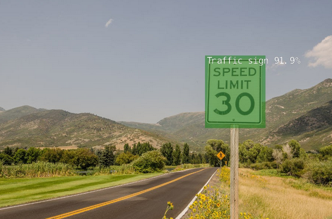
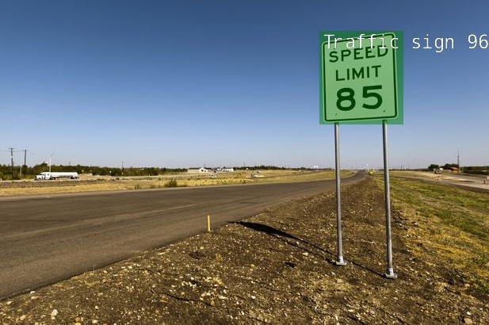
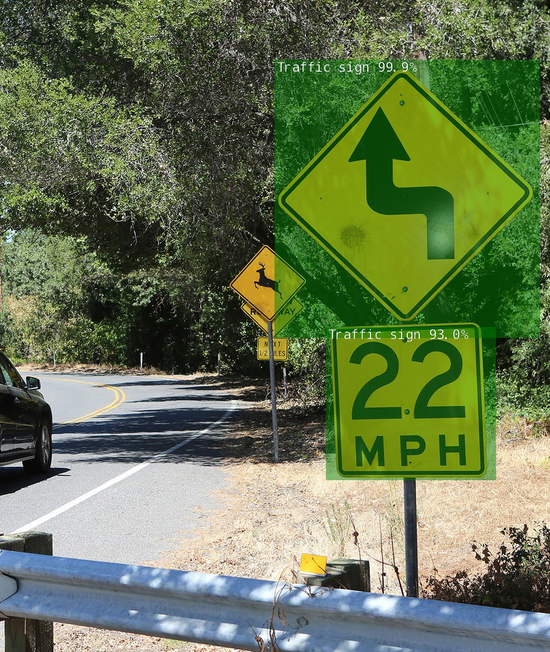

## Object Detection Model Training

The first necessary to training the model is to download and compile the jetson inference libraries and tools. These libraries allow for the usage of classification models, object detection models, and semantic segmentation models in Python/C++. The tools are useful for downloading the dataset and training. [Nvidia has a good guide on how to set this up](https://github.com/dusty-nv/jetson-inference/blob/master/docs/building-repo-2.md), so I'm not going to delve into many details in this documentation.

When you're at the "download models" screen of the build process, make sure to select "SSD-Mobilenet-V2" from the object detection models list.

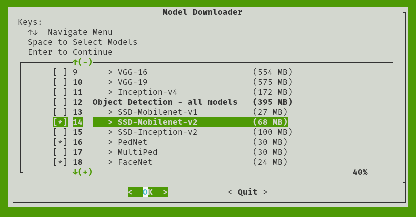

Make sure to install PyTorch too! This will be necessary for training.

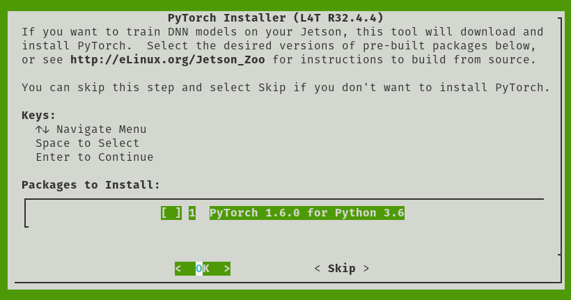

Nvidia provides a tool to fetch data from the Open Images resources, so use that to fetch the traffic sign dataset.

```
$ python3 open_images_downloader.py --class-names "Traffic sign" --data=data/signs
```

Before training, it's important to setup a Swap partition. A Swap partition allows for a computer to store data on a drive when it runs out of RAM. Training almost certainly needs all of the RAM and then some on the Jetson Nano (especially the 2GB variant), so a Swap partition is needed to prevent the training from crashing. You can setup a Swap partition on the microSD card, but because of their limited read/write cycles, it's not recommended. An external mechanical drive or flash drive you don't care about works better. Once your external drive is plugged in, find the partition location:

```
$ sudo fdisk -l
Disk /dev/sda: 7.5 GiB, 8004829184 bytes, 15634432 sectors
Units: sectors of 1 * 512 = 512 bytes
Sector size (logical/physical): 512 bytes / 512 bytes
I/O size (minimum/optimal): 512 bytes / 512 bytes
Disklabel type: dos
Disk identifier: 0xee75763f

Device     Boot Start      End  Sectors  Size Id Type
/dev/sda1        2048 15634431 15632384  7.5G 82 Linux swap / Solaris
```

My Swap partition is located on `/dev/sda1`. I recommend using [cfdisk](https://tldp.org/HOWTO/IBM7248-HOWTO/cfdisk.html) if you need to create a Swap partition. Once it's created, run the following to enable it:

```
$ sudo mkswap /dev/sda1
$ sudo swapon /dev/sda1
```

The Swap partition won't be recognized upon reboot. If you need the Swap partition after reboot, run the `swapon` command. Now for the training!

To train, run the following command.

```
$ python3 train_ssd.py --data=data/signs --model-dir=models/signs --batch-size=4 --epochs=30
```

Increasing the number of Epochs will increase the accuracy of the object detection model, but it will also increase training time. Past 30 Epochs, the accuracy returns are diminishing, but feel free to test! I didn't run the training command with `time`, so unfortunately I don't have an exact measure of how long this took. It needed to whole night to train, so I would estimate 8 to 9 hours for 30 Epochs. Increasing batch size will increase parallelization of the training process, but it requires more system resources. Since the RAM is a bottleneck, increasing batch size won't help much. You can also train on another computer with an Nvidia GPU (both training and running inference on the models requires CUDA, which only works on Nvidia GPUs), which would be faster and not require Swap. I don't have a computer with an Nvidia GPU to test though!

The model needs to be converted to the ONNX format to work with my software. This only takes about a minute.

```
$ python3 onnx_export.py --model-dir=models/signs
```

## Classification Model (Attempt)

Being able to detect and localize traffic signs is the first important step. Determining the contents of that sign is the next critical step. I tried to treat this problem as an image classification problem. Perhaps if I created categories for each type of speed limit sign (10, 15, 20, etc), and gathered enough images of each type of traffic sign, I could train a classification model to differentiate traffic signs. However, this worked poorly for a number of reasons.

- There's no existing dataset for this purpose, and making my own was hard! I used Wolfram Mathematica to scrape images of speed limit signs from the web, and annotated images as necessary.
- In the end, I still had fewer than 100 images per category, which is not enough for an accurate model.
- There are a lot of categories, and the images between categories are quite similar.

[You can find my dataset here](https://github.com), but here is a collage of the dataset for your viewing pleasure.

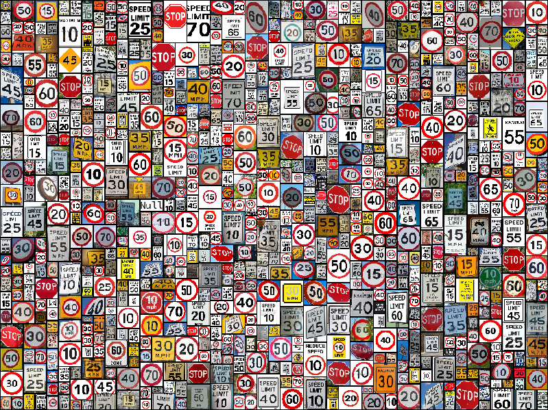

When trained on the Resnet-18 classification model for 30 Epochs, I rarely achieved 20 percent confidence in any category when given an image. The example below is a 30 MPH speed limit sign, and the highest confidence level of the classification model was a stop sign at 15 percent (the classification model received the image after the object detection localization crop). Pretty bad!

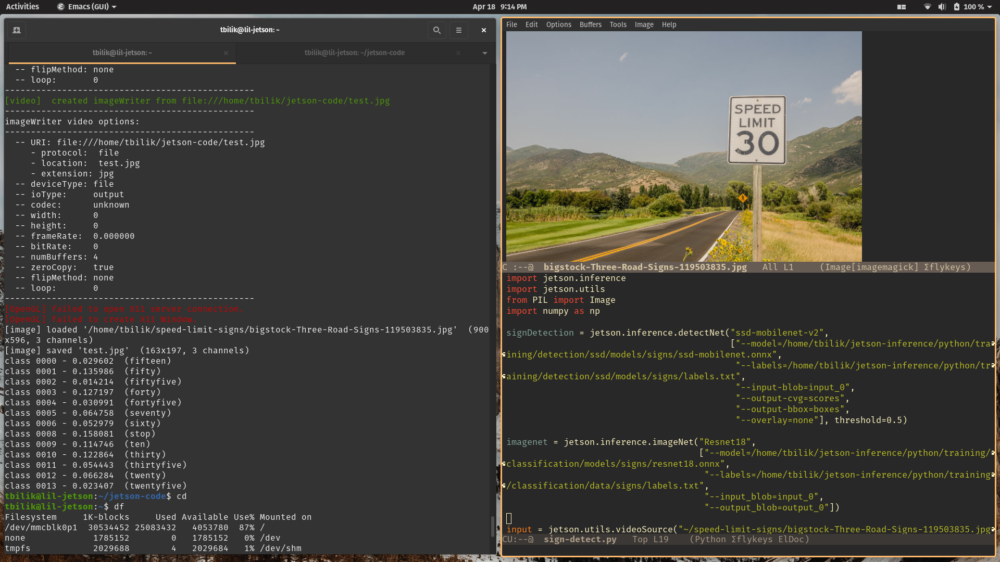

There are other classification models besides Resnet-18, but accuracy was so bad with Resnet-18 that I highly doubt other classification models would provide enough accuracy gains to be useable.

## OCR Investigations

When traditional image classification didn't work, I decided to look into optical character recognition. Optical character recognition allows for characters in a image format to be converted to machine-encoded strings. The most popular software for optical character recognition is [Tesseract](https://github.com/tesseract-ocr/tesseract). Hewlett-Packard Laboratories developed Tesseract in 1994 and was maintained by Google from 2006 to 2018. The open-source community currently develops and maintains it. It does use neural networks, but it's not using any GPU acceleration like the object detection and classification models. In particular, it usesthe LSTM (long short-term memory) network model. LSTM is designed for sequences of data, such as speech, video, and writing. I wasn't sure if it would compile and/or run on the Jetson Nano due to CPU architecture differences, but it compiles and runs without issue, from what I've tested.

[I used this resource to build and install Tesseract on the Jetson Nano.](https://tesseract-ocr.github.io/tessdoc/Compiling.html) It's a general setup guide, but there isn't anything you have to do differently for it to compile on the Jetson Nano. Once Tesseract is installed, you need to download a trained model. To fetch the tessdata_best model, run this:

```
$ cd local/share/tessdata/
$ wget https://github.com/tesseract-ocr/tessdata_best/blob/master/eng.traineddata
```

[If you want to know more about the other Tesseract models, check this out.](https://tesseract-ocr.github.io/tessdoc/Data-Files.html). If you're interested in doing some retraining of the OCR (I didn't have the time or data to do retraining), you will need to use tessdata_best.

Even if traditional image classification did work, it would likely struggle with certain types of signs that OCR wouldn't. Here's an example of what I mean.

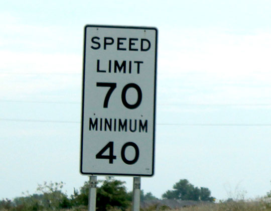

Even a well-trained image classification model would have low confidence results. Is is a 70 mph speed limit sign, or a 40 speed limit sign? With an OCR, we can fetch the text from the sign, and then use regular expressions to get the speed limit from the text (more on that later).

## Developing a Power Supply for a Vehicle

I couldn't find a convenient power supply on the market that could supply the power needed from a vehicle to the Jetson Nano. Most USB power supplies for vehicles don't output enough power. Whether you're tapping into the cigarette lighter port, the fuse box, or the radio head unit, it will output approximately 12 Volts, plus or minus 2 Volts. I decided to tap into the power from the cigarette lighter plug, as it's the most convenient. In my car, the fusebox is located near the door hinge, so it's an inconvenient power source. I used an adapter that broke out the power and ground connections from the cigarrete lighter plug, and soldered that to a buck converter that steps down the power to 5 Volts. It outputs a maximum of 3 Amps, which seems to be enough in my case. If you're hooking up more peripherals or equipment to the Jetson Nano, you may need a 4 Amp buck converter.

For non-USB power, the Jetson Nano can be powered with the barrel jack or with the power and ground connections on the GPIO layout. Using the barrel jack looks cleaner aesthetically, so I opted to do that. I used a cable that took the power and ground connections from the buck converter and outputed the power through a 5.5x2.5mm barrel jack.

The wire-to-wire soldering is relatively straightforward. Solder the red and black wires from the cigarette light plug adapter to the red and black wires of the buck converter input. Solder the red and black wires of the barrel jack cable to the yellow and black wires of the buck converter output. Make sure you're using heatshrinks to cover up the solder joints, assuming you don't want to short the car battery! The end result should look something like this:

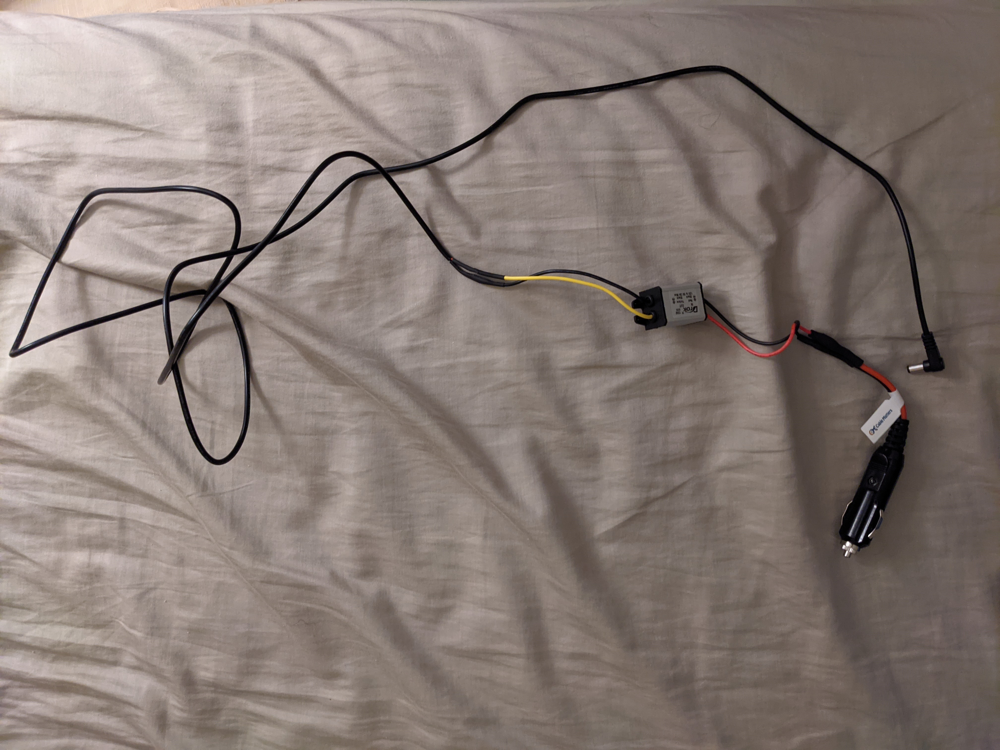
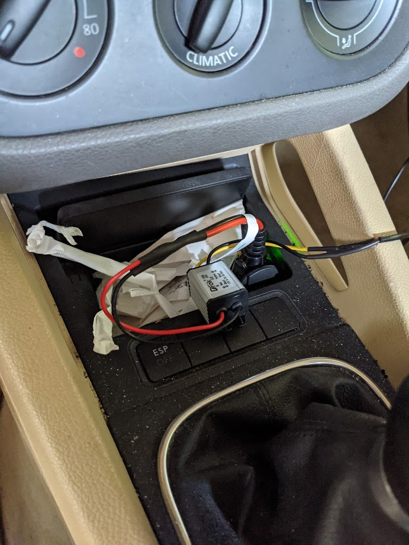

## Enabling PWM on the Jetson Nano

Pulse Width Modulation (PWM) creates a [square wave digital signal](https://www.analogictips.com/pulse-width-modulation-pwm/). This allows for controlling brightness of an LED, changing the frequency of a passive buzzer, etc. The Jetson Nano doesn't have any software PWM and only has hardware PWM on two pins. Hardware PWM isn't enabled by default, though. Annoyingly, the hardware PWM will quietly not work in its disabled state. It doesn't throw an error, permission denied, etc. It initially made me think there was an issue with my carrier board when I tried to use it and it didn't work! Anyways, to enable it, run the following:

```
sudo /opt/nvidia/jetson-io/jetson-io.py
```

Select "configure Jetson for compatible hardware" in the command line menu. You should be brought to a screen that looks like this:

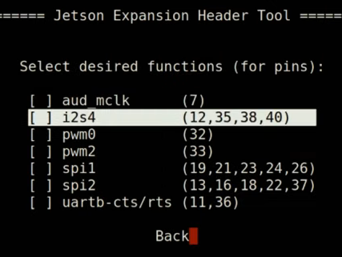

Enable pwm0 and pwm2 in this menu. You can then hit "back" on the menu, and then select "save and reboot to reconfigure pins". Once rebooted, PWM should be good to go! If you want to do some tests with LEDs, [Paul McWhorter has a good video explaining this all.](https://www.youtube.com/watch?v=eImDQ0PVu2Y)

## OBD-II

Of course, to do speeding detection, the speed of the vehicle is necessary. GPS can be used to calculate speed, but I wanted to avoid using GPS for the project. To determine speed without GPS, an interface to the vehicle diagnostics system is needed. The ELM327 by Microchip is a popular and affordable choice for this. It provides a serial interface to fetch Process IDs like vehicle speed, engine speed, engine temperature, etc. There are both USB and Bluetooth variants of the EML327. I have a Bluetooth variant, but I would go with a USB variant if possible. The USB variant is not prone to Bluetooth vulnerabilites, doesn't require a networking card on the Jetson Nano, and will likely be more reliable in the long run.

There is a kernel option that needs to be enabled to use the ELM327. Unfortunately, this means the kernel and kernel modules will need to be re-built from source code. You can check if the kernel option is set with the following command.

```
$ zcat /proc/config.gz | cat RFCOMM_TTY
```

If it returns `CONFIG_BT_RFCOMM_TTY=y`, no further preparation is needed. Most likely, it will return `CONFIG_BT_RFCOMM_TTY is not set`, in which case, you will need to proceed.

[Go to this website and find the OS version you installed on the Jetson Nano.](https://developer.nvidia.com/embedded/linux-tegra-archive) Select it, and then copy the link labelled *L4T Driver Package (BSP) Sources*.

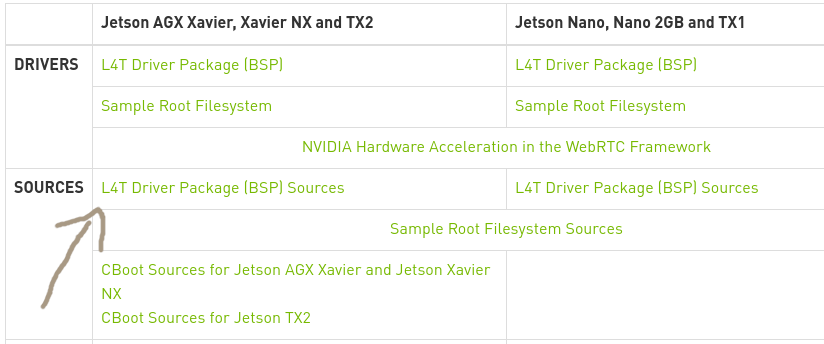

Now run the following commands.

```
$ wget <link>
$ tar xvf Jetson-Nano-public_sources.tbz2 public_sources/kernel_src.tbz2
$ mv public_sources/kernel_src.tbz2 .
$ rm -rf public_sources/
$ rm Jetson-Nano-public_sources.tbz2
$ tar xvf ./kernel_src.tbz2
$ rm kernel_src.tbz2
```

The kernel code is now extracted.

```
$ cd ~/kernel/kernel-4.9
$ zcat /proc/config.gz > .config
$ echo CONFIG_BT_RFCOMM_TTY=y >> .config
```

The kernel is now configured. If there's any configurations you would like to change for the kernel, do so now. If you want to use the menu-based kernel config interface, first install the `libncurses5-dev` dependency and then run `make menuconfig`. The commands below will build the kernel.

```
$ make prepare
$ make modules_prepare
$ make -j5 Image
$ make -j5 modules
```

Building the kernel and the kernel modules takes about an hour altogether, although build time varies based on any configurations you changed. Once your ready to install the kernel, run the following.

```
$ sudo cp /boot/Image /boot/Image.original
$ sudo make modules_install
$ sudo cp arch/arm64/boot/Image /boot/Image
```

This creates a backup kernel in the boot directory titled `Image.original`. If your Jetson Nano fails to boot after installing the new kernel, take the SD card out of the Jetson Nano, put it in your computer, and rename `Image.original` to `Image`. Unfortunately, the Jetson Nano doesn't use the GRUB bootloader, so switching between kernels is cumbersome.

Once the kernel is all set, we can actually connect the ELM327! If you're using a Bluetooth variant, you will need to connect with `bluetoothctl`.

```
$ sudo rfkill unblock all
$ sudo bluetoothctl
[bluetooth]# power on
[bluetooth]# agent on
[bluetooth]# scan on
[NEW] Device 40:D2:A4:02:F9:0B OBDII
[bluetooth]# pair 40:D2:A4:02:F9:0B
```

The `pair` command will likely ask for a pin, which is normally `1234`. Once the pairing is complete, you can quit `bluetoothctl` with the `exit` command. To connect the paired device, run the following command.

```
$ sudo rfcomm bind 0 40:D2:A4:02:F9:0B 1 &
```

Now everything is set for my `obdii.py` program!

## Misc Setup Stuff

To get my code, clone my code repository.

```
$ git clone https://github.com/tbilik/jetson-code
```

For my programs to work, you will need to create a FIFO file labelled `display_fifo`.

```
$ mkfifo display_fifo
```

Download all of the python modules needed.

```
$ sudo su
# pip3 install sixel adafruit-blinka adafruit-circuitpython-ht16k33
# pip3 install git+https://github.com/brendan-w/python-OBD.git#egg=python-OBD
```

To run my programs on startup, a cronjob is needed.

```
$ sudo crontab -e
```

It will ask for your favorite editor, and then it will go to the cronjob file. Add the following line.

```
@reboot /home/tbilik/jetson-code/startup.sh
```

You can put anything else you want to start at boot here. Just prefix it with `@reboot` like I did above. Also, modify the `startup.sh` script with the address of your ELM327 device. Make sure the cron daemon is enabled on startup.

```
$ sudo systemctl enable cron.service
```

You can also disable LightDM to save some system resources. Disabling LightDM means you will be put into the CLI at boot, but you can always activate the GUI with `startx`.

```
$ sudo systemctl disable lightdm.service
```

## Code Overview

There are three Python programs in my [code repository](https://github.com/tbilik/jetson-code): `display_driver.py`, `sign-detect.py`, and `obdii.py`. 

Let's start with the simple one: `obdii.py`. `obdii.py` uses [Brendan W's library](https://github.com/brendan-w/python-OBD/) to connect with the ELM327 and fetch the speed of the vehicle. It's converted to miles per hour and then is printed to `display_fifo` prefixed with an `A`. It polls the ELM327 once a second.

The name of `display_driver.py` is slightly misleading. It does indeed control the 7-segment display, but it also controls the buzzer and reset button. `display_driver.py` gets vehicle speed and speed limit data through the FIFO. As mentioned above, data prefixed with an A is vehicle speed. Data prefixed with a B is a speed limit (this data is provided by `sign-detect.py`). The vehicle speed is put on the left two digits of the 7-segment display, and the speed limit is put on the right two digits of the 7-segment display. If the speed of the vehicle is 10 miles per hour or more over the speed limit, the buzzer is activated at a frequency of 2000 Hz. It's not loud, but not easy to ignore either haha. Pressing the reset button will disable the buzzer.

Finally, there's `sign-detect.py`. There's a few different modes for this program, depending on the image/video input. If `camera` is the argument provided, it will use the CSI camera as input. If a file is the argument provided, it will use that file as input. If no argument is provided, it will run in demo mode, which will prompt the user for a file.

Once a frame or image is loaded, it will be ran through the object detection model. If object(s) are detected, that frame will be converted from RGB to grayscale. The grayscale image is then cropped to the region of interest. More specifically, it does a 90% center crop of the region of interest, since that often removes the borders of the speed limit sign. Finally, the image is binarized. The program then forks. The child process runs the image through the OCR, while the parent process keeps processing frames.

Once the OCR outputs text, the child process runs the text through a regular expression. The regular expression is `(?i)SPEED(.*)LIMIT(.*)\d\d`, which means that it looks for the word "SPEED", followed by "LIMIT", followed by two digits. The pattern is still met if there are characters between SPEED and LIMIT or LIMIT and the two digits. `(?i)` disables case insensitivity. If the pattern is met, the numbers are pulled and sent to the FIFO prefixed with a `B`.

A few notes about the demo mode:

- If you put an integer as the input, it will be sent to the FIFO as vehicle speed data.
- Images are displayed to the terminal via `sixel`. Demo mode also shows the image that will be processed by the OCR. The terminal emulator `mlterm` is needed for `sixel` to work properly. Other methods of displaying an image with a terminal, such as `w3m-img`, don't work over an SSH connection.
- The parent process will wait for any child processes to finish before continuing in demo mode.

Here's a cool example of demo mode:

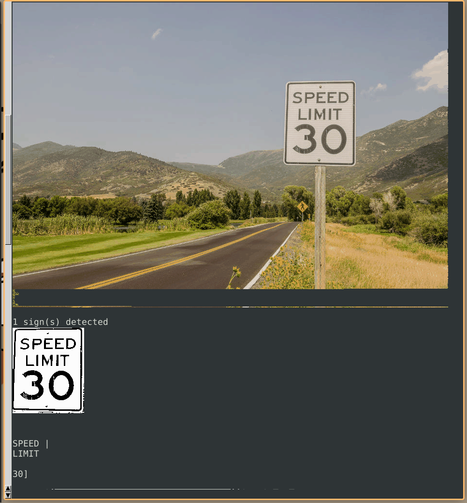

The display will then update to show that the speed limit is indeed 30 miles per hour, and if you give it vehicle speed data of over 40 miles per hour, the buzzer will activate.

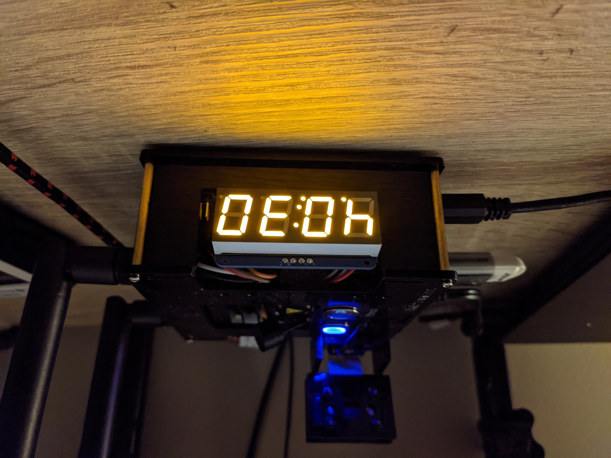

## Project Improvements

In practice, my prototype works poorly. The camera I use has mediocre focus and a wide-angle perspective, making it difficult for the object detection model and OCR. I think a camera that had a shorter angle range and better focus would perform much better. Some example shots from my camera:

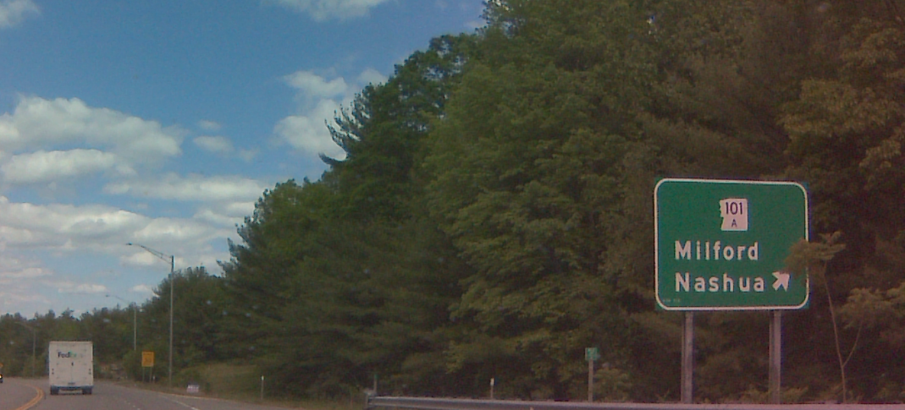
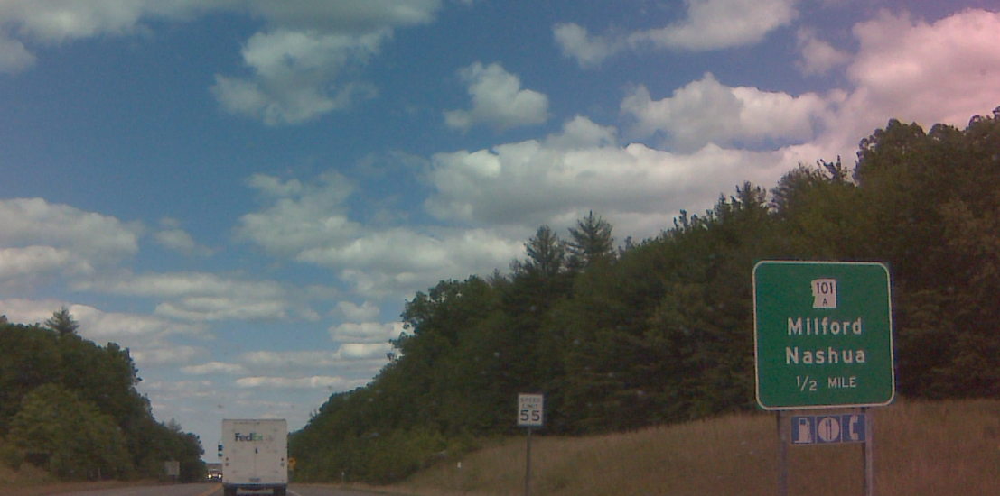
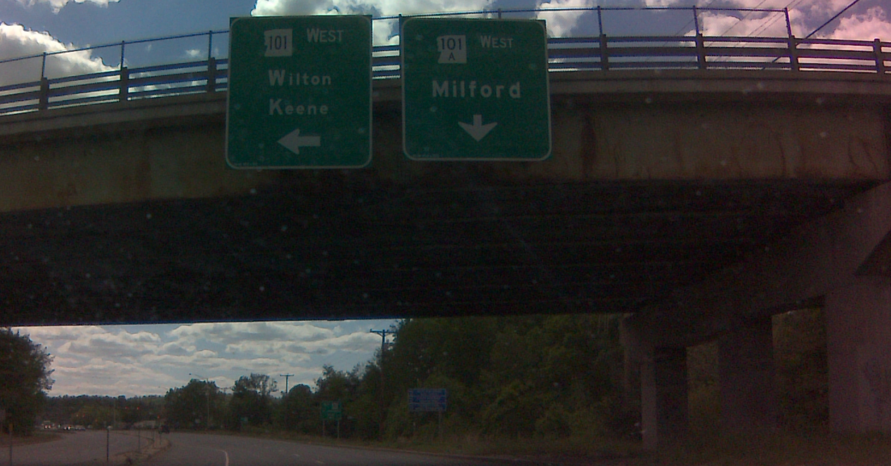

Having some recorded video footage from the camera could also be useful, as it could be used as training data for the object detection model and OCR. You would likely need an external storage device to record video footage. In addition, you may need to use a beefier power supply if the external storage device is a mechanical drive. Programming it to record video while running inference at the same time would be really cool too, as then it could be smart dashcam of sorts!

Traffic signs are often slanted, especially in New England, where the signs posts often get pressure from the snow from plows. While the OCR can handle slight slants, [text skew correction](https://www.pyimagesearch.com/2017/02/20/text-skew-correction-opencv-python/) could improve accuracy.

Although I like the aesthetic of the 7-segment display, it gets washed out easily from sunlight. An e-ink display would likely look much better. You could put more information on an e-ink display too!

While mounting the prototype on the dashboard is convenient, it may not be the best location. Mounting the prototype somewhere else would likely prevent the sun from beaming on the heatsink. While my prototype never overheated, it's something to think about. Due to airbags, the dashboard isn't the safest place to mount the prototype.

## Thanks!

A quick thank you to Amy Bewley, Scott Bilik, Claire Bilik, and anyone else who helped me with the project. And thank you to reading all the way down this far! 


